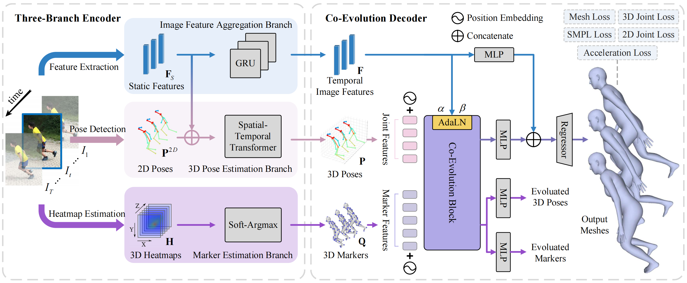
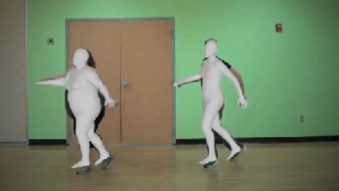

PMCE++ extends the original [PMCE](https://github.com/kasvii/PMCE), presented at ICCV 2023, to achieve pose-and-shape accuracy, temporal consistency, and efficiency in 3D human mesh reconstruction from videos.

<p align="center">
     
</p>
<p align="center">
   
   
   
   
</p>

## Preparation

1. **Install dependencies.** This project is developed on Ubuntu 18.04 with NVIDIA 3090 GPUs. We recommend you to use an [Anaconda](https://www.anaconda.com/) virtual environment.
```bash
# Create a conda environment.
conda create -n pmce_plus python=3.9
conda activate pmce_plus

# Install PyTorch >= 1.2 according to your GPU driver.
conda install pytorch==1.11.0 torchvision==0.12.0 torchaudio==0.11.0 cudatoolkit=11.3 -c pytorch -c conda-forge

# Pull the code
git clone https://github.com/kasvii/PMCE-plus.git --recursive
cd PMCE-plus

# Install other dependencies.
pip install -r requirements.txt

# Install ViTPose
pip install -v -e third-party/ViTPose

# Install VirtualPose
pip install -v -e third-party/VirtualPose
```
2. **Prepare base data** including SMPL models, checkpoints, and example video.
To download SMPL models, register for [SMPL](https://smpl.is.tue.mpg.de/) and [SMPLify](https://smplify.is.tue.mpg.de/) and then the usernames and passwords will be used to fetch the data.
Run the script to download all the dependencies.
```bash
bash prepare_base_data.sh
```

## Quick Demo
1. **Please check** that the above preparation was successfully done.
2. **Run.** The output is at `./output` folder.
```bash
python demo.py --video examples/demo.mp4 --visualize
```

## Test
To test on a pre-trained mesh model, run
```bash
python -m lib.eval.evaluate_{dataset_name} --cfg configs/yamls/test_{dataset_name}.yaml
```
Change the `{dataset_name}` to the dataset (including `3dpw`, `h36m` and `mpii3d`) you want to test.

```bash
# 3dpw
python -m lib.eval.evaluate_3dpw --cfg configs/yamls/test_3dpw.yaml

# h36m
python -m lib.eval.evaluate_h36m --cfg configs/yamls/test_h36m.yaml

# mpii3d
python -m lib.eval.evaluate_mpii3d --cfg configs/yamls/test_mpii3d.yaml
```

## Train
To train PMCE-plus by yourself, run
```bash
python train.py --cfg configs/yamls/train_{dataset_name}.yaml --gpu 0
```
Configs of the experiments can be found and edited in `./configs/yamls` folder.

```bash
# 3dpw
python train.py --cfg configs/yamls/train_3dpw.yaml --gpu 0

# h36m
python train.py --cfg configs/yamls/train_h36m.yaml --gpu 0

# mpii3d
python train.py --cfg configs/yamls/train_mpii3d.yaml --gpu 0
```

## Citation
Cite as below if you find this repository is helpful to your project:
```bibtex
@inproceedings{you2023co,
  title     = {Co-Evolution of Pose and Mesh for 3D Human Body Estimation from Video},
  author    = {You, Yingxuan and Liu, Hong and Wang, Ti and Li, Wenhao and Ding, Runwei and Li, Xia},
  booktitle = {Proceedings of the IEEE/CVF International Conference on Computer Vision},
  pages     = {14963--14973},
  year      = {2023}
}
```

## Acknowledgement
This repo is extended from the excellent work [WHAM](https://github.com/yohanshin/WHAM), [VirtualMarker](https://github.com/ShirleyMaxx/VirtualMarker), [PMCE](https://github.com/kasvii/PMCE). We thank the authors for releasing the codes.